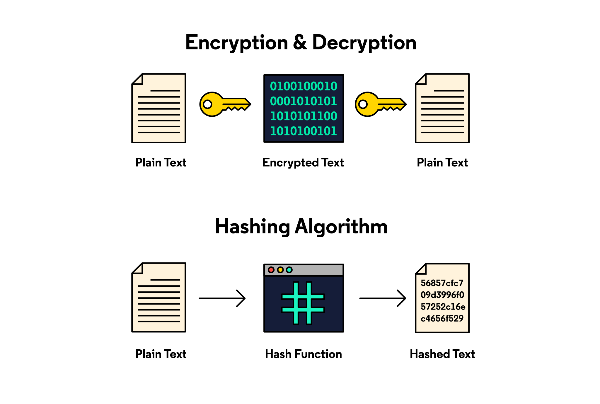

## **What is hashing?**

Hashing is the process of converting data — text, numbers, files, or anything, really — into a fixed-length [string](https://www.codecademy.com/resources/docs/general/string?utm_source=ccblog&utm_medium=ccblog&utm_campaign=ccblog&utm_content=cw_hashing_blog) of letters and numbers. Data is converted into these fixed-length strings, or hash values, by using a special algorithm called a hash function.

For example, a hash function that creates 32-character hash values will always turn text input into a unique 32-character code. Whether you want to generate a hash value for the word “Codecademy,” or for the entire works of Shakespeare, the hash value will always be 32 characters long.

## What’s the difference between hashing and encryption?

Hashing and encryption are both ways of transforming data, but they are used for different purposes. Hashing is a one-way process that turns data into a fixed-size string of characters, which is unique to that data. Once the data is hashed, it can’t be changed back to its original form. This makes it useful for things like password storage or digital signatures.

Encryption, on the other hand, is a two-way process that scrambles data so it can only be read by someone with the correct key. Encryption is used to protect sensitive information, like credit card numbers, so only the intended recipient can decrypt and read it.

The key difference is that encryption can be undone with the right key, while hashing is irreversible.

## **How does hashing work**?

### **Input data is key**

The input data to be hashed is also known as the key. A key can be in just about any format. It could be a string of text, a list of numbers, an image, or even an application file.

### **The hash function**

The central part of any hashing process is the hashing function. The hashing function takes the key and converts it to a fixed-length string of characters. But how exactly does that work? How is it that your name and a novel can both be condensed into the same number of characters? 

The secret is dividing the data into equal-sized blocks.

The most popular hashing algorithms work with block sizes between 160 and 512 bits. A bit is the basic unit of computer information and corresponds to either a binary 1 or 0.

Let’s suppose that we’re working with SHA-1, a popular hash function that works with block sizes of 512 bits. 512 bits is about the same as 32 words. So, if we have a short message to hash, then the SHA-1 function only needs to run once to generate a final hash value.

Of course, most files and datasets are much larger than that. So, the algorithm divides all of the data into 512-bit chunks. If our data is 1024 bits, then the algorithm first runs the SHA-1 function for the first chunk of data, generates a hash value, then combines this first hash value with the second half of the data to generate a final hash value.

For larger inputs, the process repeats until all the 512-bit chunks have been processed by the hashing algorithm. A hash function might process a large dataset or file thousands or even hundreds of thousands of times before it generates the final hash value. This is why hashing algorithms need to be efficient in order to be effective.

### **The hash value**

The final output of the hash function is the hash value, which ideally should be unique to each input. Hash values may only need to be used once for data authentication or digital signatures. Or, they may be stored for easy lookup in a hash table.

### Hash tables

One of most popular uses of hashing is for setting up hash tables. A hash table is a way to store data in a way that makes it easy and fast to find later.

Imagine you have a list of items, and each item has a unique name. Instead of searching through the entire list to find an item, a hash table uses a hash function to quickly figure out where to store each item based on its name. When you want to look something up, the hash table uses that same formula to quickly find the item’s location. This makes searching, adding, or removing items much faster compared to other methods. That’s why hash tables are used in many places, like in databases or caches, because they help find things quickly.

### Hash collision

A hash collision happens when two different items, or keys, get assigned to the same spot in a hash table. This can happen because the hash function, which decides where to store each item, sometimes gives the same location to two different pieces of data.

Think of it like two people having the same house number on the same street—there’s a mix-up because they’re both trying to use the same address.

When a collision occurs, the hash table has methods to fix the problem, like storing both items together at that spot or finding a new spot for one of them. The goal is to make sure the data is stored correctly and can still be found quickly.

## **What are some properties of hashing algorithms**?

There are several different approaches hashing algorithms use to convert data into hash values, but they all share a few common characteristics:

### **Deterministic**

If you use the same data input and the same hashing algorithm, then the final hash value should be the same. This is a key aspect of using hash functions to authenticate data.

Ideally, no two inputs in a hashing algorithm should yield the same output hash value. This is known as a collision, and the best hashing algorithms have the fewest instances of collisions.

### **Quick computation**

Remember that hashing algorithms process data in small chunks to generate a final hash value. An effective hashing algorithm quickly processes any data type into a unique hash value.

### **Irreversible**

Hash functions are designed to make it impossible to regenerate a message or file from the hash value. In fact, if the hashing function can be reversed to recreate the original input, it’s considered to be compromised. This is one thing that distinguishes hashing from encryption, which is designed to be reversible.

## What are some **popular hashing algorithms**?

Since the early days of digital computing, various hashing algorithms have been developed, each with its own methods, advantages, and disadvantages.

Here are three popular hashing algorithms used today:

### **Message Digest 5 (MD5)**

MD5 was once the most common hashing algorithm in the early days of computer cryptography. But, the algorithm suffered from frequent collisions, and while it’s still widely used around the world, it’s no longer used for sensitive or confidential data.

MD5 is also significantly slower than the algorithms listed below, and there’s a greater chance of ending up with the same hash value for two different inputs.

### **Secure Hash Algorithm (SHA)**

SHA actually refers to a group of hashing algorithms. The SHA-2 family of hash functions was originally developed by the US National Security Agency (NSA) and is the standard for hashing private data. It’s currently used by cryptocurrencies and the CIA.

### **CRC32**

When the primary purpose of hashing is to detect errors and changes in data, most people work with a cyclic redundancy check (CRC) code. Hashing with CRC32 is also a quick and easy way to check file integrity, particularly with ZIP files and files downloaded from FTP servers.

## **How is hashing used?**

Hashing is used in a variety of applications, from cybersecurity to blockchain to data privacy. Here are a few ways that people use hashing every day.

### Password storage

When you create a password for a website, the website doesn’t store the password itself for security reasons. Instead, it applies a hashing algorithm to your password, turning it into a scrambled string of characters. This hash is then stored in the database.

Later, when you enter your password, the website hashes the password and compares it to the stored hash. If they match, you’re granted access. Since the hash is just a unique representation of your password, even if someone steals the hash, they can’t easily figure out your password. This method helps keep your password secure by never storing the actual password itself.

### Digital signatures

Similar to storing passwords, hashing is also used in digital signatures to verify the identity of the sender and make sure the document hasn’t been tampered with. When someone wants to sign a document digitally, a hashing algorithm is first applied to the content of the document. This hash is then encrypted using the sender’s private key, creating the digital signature.

The recipient can use the sender’s public key to decrypt the signature and get the original hash. They then apply the same hashing algorithm to the document themselves and compare the two hashes. If they match, it proves the document is unchanged and was indeed signed by the sender. This process ensures both security and authenticity.

### **Message and data authentication**

Hashing helps Cybersecurity Specialists ensure that data isn’t intercepted between the sender and the recipient.

Let’s pretend that we’re both spies. We’re working in different cities, doing spy stuff. Since we don’t have a secure internet connection, the only trusted way for us to communicate with each other is by sending hand-delivered notes.

But if I send a note to you, how can we make sure that no one’s tampered with my message? I can encrypt the message, but if someone else has figured out the encryption, how do we know they haven’t intercepted my message and replaced it with another one?

One solution is to use a hashing algorithm to turn the contents of my message into a series of characters. If we can both turn my message into the same string of characters with the hashing algorithm, we’ll know no one tampered with my message.

In other words, hashing is a way to authenticate data or show that the data received wasn’t changed along the way. When you’re downloading software, hashing helps ensure what you’re installing is the original code and not compromised by a virus, trojan, or other malware.

### **Detecting changes in data**

Even when you’re working with non-sensitive data, hashing is an effective way to compare two sets of data and see if they’re different.

Let’s look at two messages and their hash values using a popular hash function called MD5:

“Meet me at Codecademy HQ on Broadway”

942206fffceea95d4c8393c77ea617ab

“Meet me at Codecadamy HQ on Broadway”

aad9085d26114958742098b18348414e

What did you notice first: the different hash values or the differences between the messages?

If you read through each message, you’ll notice that the word “Codecademy” is spelled differently in the second message. Now, imagine that you want to find out whether two versions of a novel are different. Even a computer would need some time to go through thousands of words. With hashing, all it takes is comparing a few characters to determine whether two sets of data are different.

### **Data privacy**

Sometimes, you want to be able to store and retrieve sensitive information. For example, many websites don’t store your actual password in a [database](https://www.codecademy.com/resources/docs/general/database?utm_source=ccblog&utm_medium=ccblog&utm_campaign=ccblog&utm_content=cw_hashing_blog) but rather your password’s hash value instead. That way, if someone does hack into the database, all they’ll find are hash values that can’t be directly used by themselves.

This is especially useful for the health and financial industries. Instead of storing directly identifiable information such as name or social security number, a health or bank database can store the hash value of this information instead.

### **Blockchain**

One of the most publicized applications of hashing is blockchain, specifically with [cryptocurrencies](https://www.codecademy.com/resources/blog/what-is-cryptocurrency/?utm_source=ccblog&utm_medium=ccblog&utm_campaign=ccblog&utm_content=cw_hashing_blog) like Bitcoin. We go [more into blockchain here](https://www.codecademy.com/resources/blog/what-is-blockchain/?utm_source=ccblog&utm_medium=ccblog&utm_campaign=ccblog&utm_content=cw_hashing_blog), but as a quick review, it’s a digital collection of transactions or records. Since everyone has access to the same data in a blockchain, how can everyone be sure none of the past transactions have been altered? That’s where hashing comes in.

In a blockchain, every new record or transaction is known as a block. In the case of Bitcoin, a block includes the transfer amount, the timestamp, and the hash value for the data in the previous block. So, if someone tried to alter the transaction history for a unit of Bitcoin, the hash values would change, and the transaction would be invalid. Hashing is how blockchains can ensure data authenticity and integrity when everyone has access to the same data.

### **Database management**

When you’re working with large databases, combing through all the different entries to find the data you need can be exhausting. Hashing can make it easier. Instead of relying on [index](https://www.codecademy.com/article/sql-indexes) structure, hashing allows you to search for a data record using a search key and hash function.

Hash files store data in buckets, and each bucket can hold multiple records. Hash functions are used to map search keys to the location of a record within a bucket.

There are two hashing methods you can use in a database management system (DBMS): Static hashing and dynamic hashing.

- With **static hashing**, a search key and hash function always lead to the same address, and the number of buckets remains fixed. When you need to add a new record to the database, you can use a hash key to automatically generate an address for the record and store it. Then, you can use the same key to locate the record when you need to access, update, or delete it.
- Unlike static hashing, **dynamic hashing** (AKA extendible hashing) allows for data buckets to be created and removed as needed. This helps prevent bucket overflow, which occurs when a bucket doesn’t have enough space for a new record. 

## **Hashing in cybersecurity**

If you’re pursuing a career in [cybersecurity](https://www.codecademy.com/catalog/subject/cybersecurity?utm_source=ccblog&utm_medium=ccblog&utm_campaign=ccblog&utm_content=cw_hashing_blog), you’ll need to understand hashing’s role in data security, integrity, and privacy. By understanding how hashing works, [Cybersecurity Specialists](https://www.codecademy.com/resources/blog/what-is-cybersecurity/?utm_source=ccblog&utm_medium=ccblog&utm_campaign=ccblog&utm_content=cw_hashing_blog) can better secure passwords, verify that data hasn’t been altered, and prevent hackers from tampering with important information.

It’s also a valuable tool for [Back-End Engineers](https://www.codecademy.com/learn/paths/back-end-engineer-career-path?utm_source=ccblog&utm_medium=ccblog&utm_campaign=ccblog&utm_content=cw_hashing_blog) and [Data Scientists](https://www.codecademy.com/learn/paths/data-science?utm_source=ccblog&utm_medium=ccblog&utm_campaign=ccblog&utm_content=cw_hashing_blog).

---

Source: https://www.codecademy.com/resources/blog/what-is-hashing/